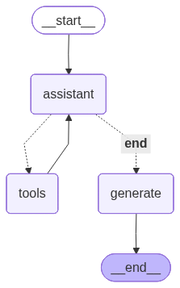

# 🦎 Lizard

An experimental LLM Agent framework built with LangChain for scalable, reliable, and modular agent systems.

# 📌 Overview

Lizard is a testing agent framework designed to explore agentic system design patterns, including tool orchestration, memory management, and multi-agent collaboration. The visualization of its workflow is shown below (you also can use ```func visualize()``` to plot it):

<p align="center">
    <br>
    Workflow of <b>Lizard</b>
</p>

<!-- The system focuses on building production-relevant capabilities such as:

- Structured conversation state management
- Reliable tool execution and validation
- Extensible architecture for multi-agent systems -->

**⚠️** This project is under active development. APIs and architecture may change frequently.

# 🛠 To-Do

- **Vector-based Memory** with ```FAISS```
- **Thread Conversion Management** with ```thread_id```
- **Cross-tool Output Verfication** to improve reliability
- **Multi-Agent Coordination**
- **Scheme Visualization** -> DONE

# 🎯 Purpose

This project is intended to demonstrate practical experience in:

- Building LLM-powered systems with LangChain
- Designing modular agent architectures
- Handling state, memory, and tool interactions
- Exploring reliability challenges in agent workflows
