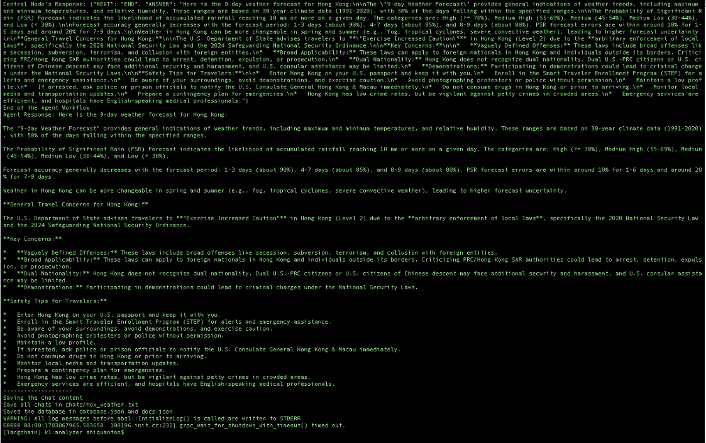

# 🦎 Lizard

An experimental LLM Agent framework built with LangChain for scalable, reliable, and modular agent systems.

# 📌 Overview

This is a testing agent framework designed to explore agentic system design patterns, including tool orchestration, memory management, and multi-agent collaboration. The visualization of the **base Agent** is shown below (you also can use ```func visualize()``` to plot it):

<p align="center">
    <br>
    Workflow of <b>Base Agent</b>
</p>

<!-- The system focuses on building production-relevant capabilities such as:

- Structured conversation state management
- Reliable tool execution and validation
- Extensible architecture for multi-agent systems -->

# 🐝 HOX

In **HOX**, we make use of the coordination among a ```coordinator```, multiple ```helper```s and a ```validator``` agent, named as **HOX**. The idea here is simple:

## Role

- ```coordinator``` is to plan, select helper and assign the task to it
- ```helper```s is to accomplish the assigned sub-task
- ```validator``` is to validate the ```helper```'s response fulfill the sub-task or not

## Workflow and Demo

So far, it is able to solve easy task, such as fetch weather information and give travel advice or suggestion, fetch job market information and give the advice, feel free to check the detailed chats in [chats/hox](chats/hox).

<div align="center">

|  | [](https://drive.google.com/file/d/1q9NZFwEyvUl1iaRKfA5AddmZUarxzXgU/view?usp=sharing) |
| :---: | :---: |
| Workflow of **HOX** | Demo of **HOX** on Weather task with Gemini-2.5 flash as LLM (2.5x speed) |

</div>

**⚠️** This project is under active development. APIs and architecture may change frequently.

# 🛠 To-Do

- **Vector-based Memory** with ```FAISS```
- **Cross-tool Output Verfication** to improve reliability
- **Multi-Agent Coordination** -> Working on it
- **Let the agent retrieve past messgae**
- **FastAPI** to make it be backhand

## 🦊 Financial Fox Workflow

Here is the workflow of **Financial Fox** workflow, to generate an instant financial report for current stock market with the world news. Below is the visualization of its workflow, and you can find the [corresponding figure](analyzer/assets/fox.png). Besides that, you can also find the [**demo chat**](analyzer/chats/fox_demo_ctx.txt) after running ```python run_fox.py```.

```
                        ┌─────────────────────────┐
                        │      User Request       │
                        └────────────┬────────────┘
                                     │
                                     ▼
                        ┌─────────────────────────┐
                        │      Central Agent      │
                        │ Determine next action   │
                        └────────────┬────────────┘
                                     │
                   ┌─────────────────┼──────────────────┐
                   │                 │                  │
                   ▼                 ▼                  ▼
             News Agent      Stock Analyst      Report Formatter
                   │                 │                  │
                   └─────────────────┴──────────────────┘
                                     │
                                     ▼
                          ┌─────────────────────┐
                          │   Validator Agent   │
                          └─────────┬───────────┘
                                    │
                    ┌───────────────┴───────────────┐
                    │                               │
                  Valid                           Invalid
                    │                               │
                    ▼                               ▼
            Store Artifact                  Store Feedback
            in Memory                       (or retry reason)
                    │                               │
                    └───────────────┬───────────────┘
                                    ▼
                             Central Agent
                                    │
                          Decide next step
                                    │
                     ┌──────────────┴──────────────┐
                     │                             │
                 Call another agent             END
                     │                             │
                     └──────────────┬──────────────┘
                                    ▼
                          Return Final Report
```

| Agent               | Responsibility                                                      |
| ------------------- | ------------------------------------------------------------------- |
| Central Agent       | Cordinate thw workfloow, Choose sub-agent and Assign it task        |
| News Agent          | Extract events, companies, sectors                                  |
| Stock Analyst       | Prices, ratios, indicators (non-LLM if possible)                    |
| Report Formatter    | Format and generate the final report                                |
| Validator Agent     | Validate whether the sub-agent accomplishs the assigned task or not |

# 🎯 Purpose

This project is intended to demonstrate practical experience in:

- Building LLM-powered systems with LangChain
- Designing modular agent architectures
- Handling state, memory, and tool interactions
- Exploring reliability challenges in agent workflows