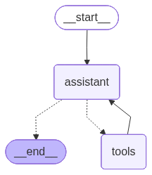
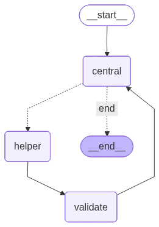

# 🦎 Lizard

An experimental LLM Agent framework built with LangChain for scalable, reliable, and modular agent systems.

# 📌 Overview

This is a testing agent framework designed to explore agentic system design patterns, including tool orchestration, memory management, and multi-agent collaboration. The visualization of the **base Agent** is shown below (you also can use ```func visualize()``` to plot it):

<p align="center">
    <br>
    Workflow of <b>Base Agent</b>
</p>

<!-- The system focuses on building production-relevant capabilities such as:

- Structured conversation state management
- Reliable tool execution and validation
- Extensible architecture for multi-agent systems -->

# 🐝 HOX

In **HOX**, we make use of the coordination among a ```coordinator```, multiple ```helper```s and a ```validator``` agent, named as **HOX**. The idea here is simple:

## Role

- ```coordinator``` is to plan, select helper and assign the task to it
- ```helper```s is to accomplish the assigned sub-task
- ```validator``` is to validate the ```helper```'s response fulfill the sub-task or not

## Workflow and Demo

So far, it is able to solve easy task, such as fetch weather information and give travel advice or suggestion, fetch job market information and give the advice, feel free to check the detailed chats in [chats/hox](chats/hox).

<div align="center">
    <table>
        <tr align="center">
            <td style="text-align: center; vertical-align: middle;">
                
            </td>
            <td style="text-align: center; vertical-align: middle;">
                
            </td>
        </tr>
        <tr align="center">
            <td>Workflow of <b>HOX</b></td>
            <td>Demo of <b>HOX</b> on Weather task with Gemini-2.5 flash as LLM</td>
        </tr>
    </table>
</div>

**⚠️** This project is under active development. APIs and architecture may change frequently.

# 🛠 To-Do

- **Vector-based Memory** with ```FAISS```
- **Cross-tool Output Verfication** to improve reliability
- **Multi-Agent Coordination** -> Working on it
- **Let the agent retrieve past messgae**

# 🎯 Purpose

This project is intended to demonstrate practical experience in:

- Building LLM-powered systems with LangChain
- Designing modular agent architectures
- Handling state, memory, and tool interactions
- Exploring reliability challenges in agent workflows
